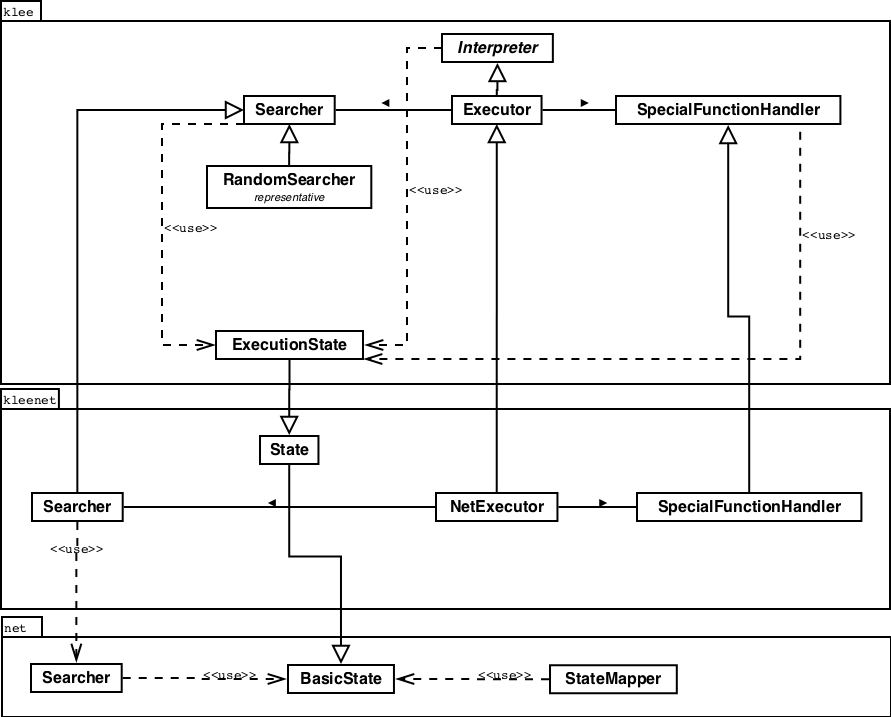
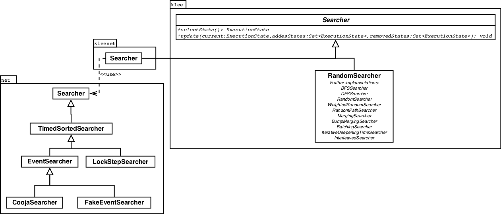
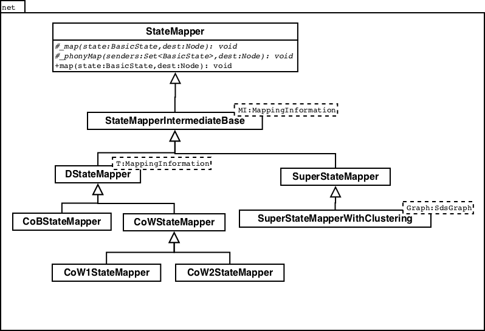
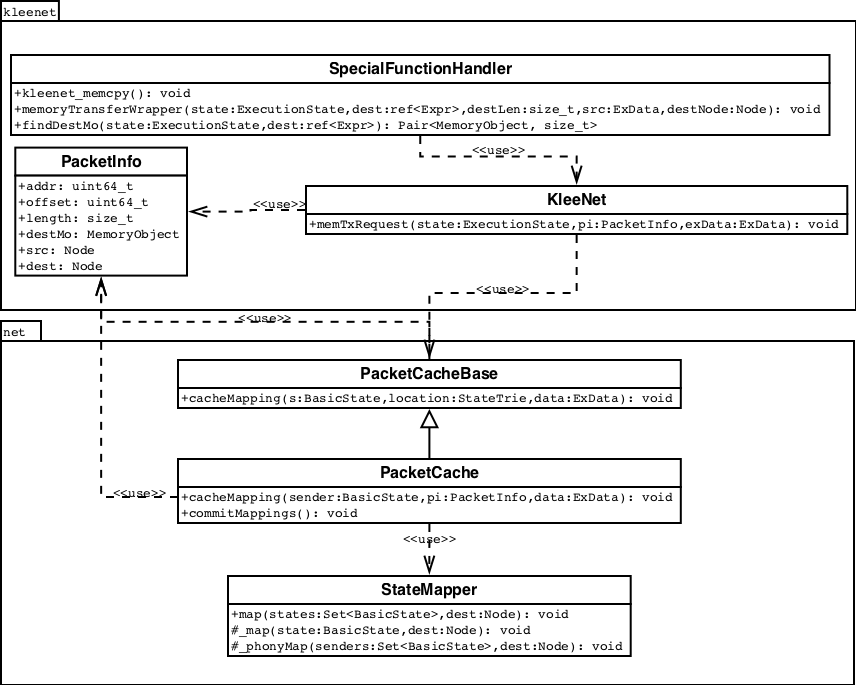

## KleeNet Documentation

KleeNet is an extension to the symbolic virtual engine [Klee][klee_homepage] enabling test case generation for distributed systems. Since this extension is mostly realized through inheritance of the Klee classes, it is highly recommended to first read the [documentation of Klee][klee_documentation] before getting into KleeNet. Furthermore, the Klee [tutorials][klee_tutorials], [publications][klee_publications], and the following paper might help to get an understanding of how symbolic execution, Klee, and KleeNet work in general:

* [KLEE: Unassisted and Automatic Generation of High-Coverage Tests for Complex Systems Programs][klee_paper_osdi08]
*  [KleeNet: Discovering Insidious Interaction Bugs in
Wireless Sensor Networks Before Deployment][kleenet_paper_ipsn2010]
*  [Demo Abstract: Integrating Symbolic Execution with Sensornet Simulation for Efficient Bug Finding][kleenet_paper_sensys2010]
*  [Scalable Symbolic Execution of Distributed Systems][kleenet_paper_icdcs2011]

#### Development Environment

For getting started there exists some [Docker][docker_homepage] container for Klee and KleeNet. Just pull one of the following containers:

* [comsys/klee-dev-base][klee_dev_base]
* [comsys/klee-dev-base-prebuilt][klee_dev_base_prebuilt]
* [comsys/klee-dev-fat][klee_dev_fat]
* [comsys/klee-dev-fat-prebuilt][klee_dev_fat_prebuilt]
* [comsys/kleenet-dev-base][kleenet_dev_base]
* [comsys/kleenet-dev-base-prebuilt][kleenet_dev_base_prebuilt]
* [comsys/kleenet-dev-fat][kleenet_dev_fat]
* [comsys/kleenet-dev-fat-prebuilt][kleenet_dev_fat_prebuilt]

The difference between the base- and fat-edition is that the base-container only ships the minimal needed packages, whereas the fat-container is suitable for development purposes. Furthermore, the container with the prebuilt postfix in their name ship already a compiled version of LLVM, Klee and/or KleeNet.

#### Command-Line Options

Klee and KleeNet can be executed with several command-line options to influence the behaviour. All available options can be accessed by typing "klee --help" or "kleenet --help" into the console. To distinguish the options between Klee and KleeNet, all options of KleeNet start with an sde-prefix for "symbolic distributed execution". For example, via "-sde-state-mapping" the state mapping algorithm can be changed.

#### Project structure

Even though KleeNet is an extension of Klee, it is desired to keep both source codes as separated and loosely coupled as anyhow possible. As a consequence, the project structure of KleeNet can be categorized in three parts: Klee's code, KleeNet code, and Net code. The code of Klee was only very slightly touched for the things that could not be solved with inheritance. For example, the SpecialFunctionHandler was in the sense modified to allow adding custom SpecialFunctionHandlers of KleeNet (for more details regarding the SpecialFunctionHandler please see the corresponding section below). The Net code is the actual part performing the distributed execution like copying states on branching etc. So this code should be (in theory) usable in combination with other (symbolic execution) tools. Finally, the KleeNet code connects the Klee and Net code to allow distributed symbolic execution with Klee. The following list is an excerpt of the KleeNet project structure and the text in the brackets indicates to which of the three described parts the folder belongs to respectively. Additionally, some of the folders include a README.txt that provides further information and might help to understand the code better.

* include
	* expr (Klee)
	* klee (Klee)
	* klee_headers (KleeNet)
	* kleenet (KleeNet)
	* net (Net)
* lib
	* Basic (Klee)
	* BasicNet (KleeNet)
	* Core (Klee)
	* Expr (Klee)
	* KleeNet (KleeNet)
	* KleeNetStub (KleeNet)
	* Module (Klee)
	* Net (Net)
	* SMT (Klee)
	* Solver (Klee)
	* Support (Klee)

### Architecture

The UML diagram below shows the main and most important components of Klee and KleeNet, which will be explained more in detail afterwards. Note, that neither this UML diagram nor the following UML diagrams in this documentation are complete; their purpose is just to show the central components required for understanding.

#### NetExecutor

The NetExecutor is the KleeNet specific implementation of the Executor in Klee. The Executor is so to speak the controller of the symbolic execution and the main concrete instance of the Interpreter class, which defines an interface to the LLVM bit code interpreter. Its entry point is the method "runFunctionAsMain", which will be called from the main method of KleeNet and prepares everything for the symbolic execution of a certain function, for example, initialising the first ExecutionState. Generally, the NetExecutor performs the same steps as the Executor, since the the overridden method "run", which will actually start the symbolic execution of a function, will also call the corresponding method of the Executor. Additionally, the NetExecutor initialises the KleeNet specific run environment needed for the distributed context and handles the "injection" of the SpecialFunctionHandler of KleeNet. The following basic steps are performed in the execution algorithm of KleeNet and Klee:

1. Check, if there are still states to execute and the flag to halt the execution is not set, otherwise stop.
2. Pick the next state to execute.
3. Check, if this state has already exceeded the maximum instruction count, then stop.
4. Execute the next instruction of that state.
5. Check, if this state has already exceeded the maximum execution time, then stop
6. Update the state by means of adding new created states caused by, for example, a branch or removing invalid and obsolete states caused by, for example, an invalid path constraint.
7. Repeat by starting again with the first point.

#### Searcher

The KleeNet and Klee Searcher selects the next state to execute based on several strategies. As a consequence, the Searcher classes and most of its methods are abstract; the implementation of those methods is realized in the different subclasses representing the different strategies like breath-first-search, depth-first-search, random-search, etc. Thereby, the most important methods are the method "selectState", which performs the actual selection of the next state based on the implemented strategy, and the method "update", which will be called by the Executor during the update process of the states to add and remove states. The Net module provides several Searchers for the the distributed execution and is connected via the KleeNet Searcher to Klee. For example, the LockStepSearcher is quite similar to Klee's Searcher which executes always on instruction, since it executes one instruction alternating each node.

#### ExecutionState

The ExecutionState stores all information of a particular state of symbolic execution. These information comprise, for example, the current instruction to be executed, the instruction which will be executed next after the current instruction, the stack, the address space and the constraints. The reason why the ExecutionState inherits from State and BasicState is that by this the Klee implementation is connected to the distributed functionality of KleeNet (please see the description of the workflows below for more details on that).

#### SpecialFunctionHandler

 

The SpecialFunctionHandler handles the specific functions of Klee and KleeNet, for example, the functions "klee_make_symbolic" to make memory symbolic or "kleenet_memcpy" for virtually sending data form one node to another. So whenever the Executor finds a not intrinsic LLVM call during interpretation, it first asks the SpecialFunctionHandler if it can handle this function before treating is as normal external function. In case you want to add an own special function there exists the macro "ADD" in the Klee SpecialFunctionHandler and "HAND" in the KleeNet SpecialFunctionHandler, which will do all the registration work. 

The following explanation of a little hack might be helpful if you ever need to change something in the Klee SpecialFunctionHandler: The Klee SpecialFunctionHandler stores all registered special functions in a static array "handlerInfo", which is also directly statically initialised with all special functions of Klee. As a consequence, adding additional functions is not efficiently possible during runtime. Therefore, a vector with the same variable name "handlerInfo" was added to the Klee SpecialFunctionHandler and the special functions of Klee and KleeNet are then added to this vector with the help of the method "learnHandlerInfo" during runtime. By this it is possible to leave the other methods of the Klee's SpecialFunctionHandler untouched, which use the variable name "handlerInfo", since private variables are preferred over outer scopes variables.

#### StateMapper

 

The StateMapper handles the mapping of packets sent by a node's state to the states of the other nodes involved in a communication. Thereby the most important methods are the method "map", which performs the actual mapping of "normal" packets, and "phonyMap", which performs the mapping of phony packets; meaning, many cached packets and sent as one bulk packet. But the implementation is realized in the subclasses of the StateMapper, since the StateMapper itself is abstract. So the actual mapping algorithm can be exchanged, e.g. currently exists a CoBStateMapper for the copy-on-branch algorithm and a CoWStateMapper for the copy-on-write algorithm.

### Workflows

#### What happens when an ExecutionState branches/forks?

When the Executor executes an instruction and this instruction is a switch-statement or a branch-statement ("if-statement") it will branch the corresponding ExecutionState. The branching of an ExecutionState is performed via the copy-constructor and since the ExecutionState extends State and State itself extends BasicState it will also lead to an execution of the corresponding copy-constructors of State and BasicState, respectively. This hierarchy of ExecutionState, State, and BasicState (see diagram below) is done to connect Klee with KleeNet (ExecutionState <-> State) and KleeNet with the Net-module (State <-> BasicState).

Now, a BasicState has a list of StateDependants - all other BasicStates that depend on that particular BasicState - as member variable which will be cloned in the copy-constructor of the BasicState. The cloning of these StateDependants will result again in a call of the copy-constructor of each StateDependant including all of its heirs (see diagram below). Finally, this boils down to an object of either CoBInformation or CoWInformation, which are both used by the StateMapper in the mapping process (see the description of the StateMapper in the Architecture part). 

Then in case of an CoBInformation object, the copy-on-branch-mechanism will be performed directly when the copy-constructor of that object is called, resulting in a fork of all peers, because all states will be forked anyway no matter whether they are involved in the communication or not. Otherwise in case of an CoWInformation the branching will only be done after a packet was sent (see next section for more details), because only the states that are involved in the communication are forked. 

#### What happens when a packet is sent?

In KleeNet a packet is sent via the SpecialHandler function "kleenet_memcpy", which is located in the SpecialFunctionHandler of KleeNet. Since KleeNet tests networks locally, the sending is actually just copying memory. So this function can somehow be compared a little bit with the "memcpy" function in the C library. As a consequence, to find the destination of a packet on a function call, the first step is to search for the corresponding destination memory object with the method "findDestMo". Next, all relevant data is packed into in a PacketInfo object and added into the PacketCache with the method "cacheMappings", which can be used to delay a certain amount of packets and send them later as bulk (phony packets). Finally, the packets in the cache are then sent with the method "commitMappings" and thereby handed over to the StateMapper which then decides in the method "map" based on the implemented algorithm (e.g., the CoWStateMapper), how to (phony)map the sent (phony)packet to each state and which states have to be therefore forked. The following diagram shows the involved classes and methods.

#### What happens if a State or Cluster is terminated?

In Klee the termination of a state is performed via the methods "terminateState", "terminateStateEarly", "terminateStateOnExit", and "terminateOnError" in the Executor. Generally, "terminateState" removes the state to terminate from all lists involved in the symbolic execution like addedStates, removedStates, seedMap, and processTree. All the three other methods will also call this method in the last step, but perform some additional actions like generating test cases or dumping stacks and error messages beforehand. While "terminateStateOnExit" and "terminateStateOnError" are quite self-explaining - terminate in case one path was finally executed and terminate because an error occurred in the current execution - "terminateStateEarly" is invoked for all other cases, for example, if the maximum	 search depth was reached.  
Now, these four methods can be also found in KleeNet in the NetExecutor and each of them works generally analogously to the respective Klee method, but this time they need to handle also clusters of states. For example, if the method "terminateState" in the NetExecutor is called, first a specific TerminateStateHandler is created and after that the method "terminateCluster" of the class "KleeNet", which connects Klee and the Net-module, is invoked. Finally, the method "terminateCluster" of the StateMapper is invoked which then terminates all states of a cluster. Thereby, the TerminateStateHandler, that is passed on every "terminateCluster" call, defines the way how a state is finally terminated and what additional actions are performed before. Especially, the TerminateStateHandler "NetExTHnd" is responsible how many test cases are generated for every cluster: one per distributed scenario (DTB_singleTestCase), one per state per distributed scenario (DTB_uniformTestCase), or one for each state per distributed scenario (DTB_forceAllTestCase) - the default case is DTB_uniformTestCase and it can be changed via the start parameter "-sde-distributed-terminate".    
At last, the NetExecutor also provides all the described methods with the suffix "klee", for example, "terminateStateOnError_klee", to terminate single states. These methods are just delegate methods and invoke the respective Klee version of that method. The following diagram shows the involved classes and methods.

[klee_homepage]: http://klee.github.io/ "Klee Homepage"
[klee_tutorials]: http://klee.github.io/tutorials/ "Klee Tutorials"
[klee_documentation]: http://test.minormatter.com/~ddunbar/klee-doxygen/ "Klee Documentation"
[klee_publications]: http://klee.github.io/publications/ "Klee Publications"
[klee_paper_osdi08]: http://www.doc.ic.ac.uk/~cristic/papers/klee-osdi-08.pdf "KLEE: Unassisted and Automatic Generation of High-Coverage Tests for Complex Systems Programs"
[kleenet_paper_ipsn2010]: https://www.comsys.rwth-aachen.de/fileadmin/papers/2010/2010-04-ipsn-sasnauskas-KleeNet.pdf "KleeNet: Discovering Insidious Interaction Bugs in
Wireless Sensor Networks Before Deployment"
[kleenet_paper_sensys2010]: https://www.comsys.rwth-aachen.de/fileadmin/papers/2010/2010-osterlind_sasnauskas-sensys-coojakleenet.pdf "Demo Abstract: Integrating Symbolic Execution with Sensornet Simulation for Efficient Bug Finding"
[kleenet_paper_icdcs2011]: https://www.comsys.rwth-aachen.de/fileadmin/papers/2011/2011-06-icdcs-sasnauskas-sde.pdf "Scalable Symbolic Execution of Distributed Systems"
[docker_homepage]: https://www.docker.com/ "Docker Homepage"
[klee_dev_base]: https://hub.docker.com/r/comsys/klee-dev-base/ "Klee Container Base"
[klee_dev_base_prebuilt]: https://hub.docker.com/r/comsys/klee-dev-base-prebuilt/ "Klee Container Base Prebuilt"
[klee_dev_fat]: https://hub.docker.com/r/comsys/klee-dev-fat/ "Klee Container Fat"
[klee_dev_fat_prebuilt]: https://hub.docker.com/r/comsys/klee-dev-fat-prebuilt/ "Klee Container Fat Prebuilt"
[kleenet_dev_base]: https://hub.docker.com/r/comsys/kleenet-dev-base/ "KleeNet Container Base"
[kleenet_dev_base_prebuilt]: https://hub.docker.com/r/comsys/kleenet-dev-base-prebuilt/ "KleeNet Container Base Prebuilt"
[kleenet_dev_fat]: https://hub.docker.com/r/comsys/kleenet-dev-fat/ "KleeNet Container Fat"
[kleenet_dev_fat_prebuilt]: https://hub.docker.com/r/comsys/kleenet-dev-fat-prebuilt/ "KleeNet Container Fat Prebuilt"
